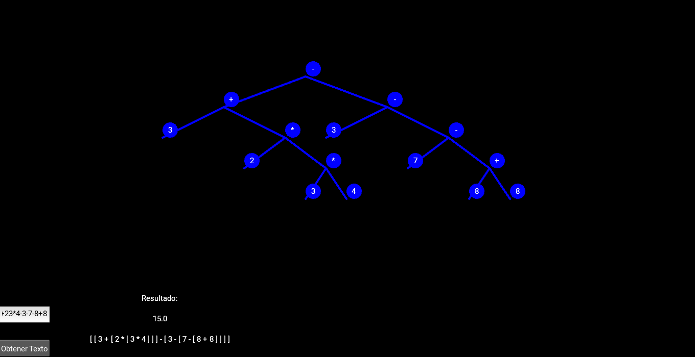
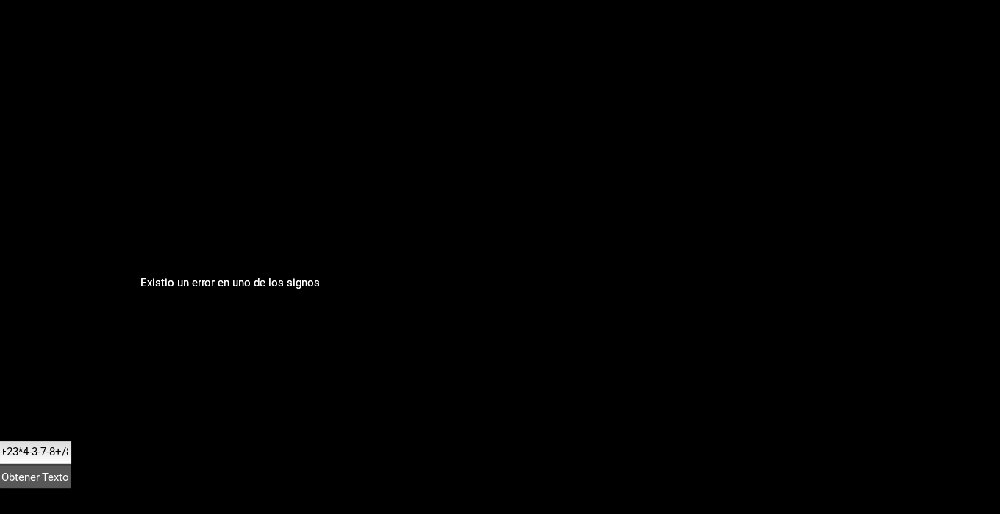

Se estan usando las siguiente librerias:
    Kivy, re, copy.
Para correr la aplicacion se encuentra en el archivo comprimido en la carpeta  dist siendo el unico archivo a correr.
La aplicacion se corre en la archivo "starApp.py", que se encuentra en la carpeta de Drive: https://drive.google.com/file/d/1L-XrCmrVsWuXcBiT-ROUaFd51cXvaiBq/view?usp=drive_link    

Tenemos la siguiente interfaz en la cual se ingresa la funcion matematica desea.
la cual sera evaluada mostrando.
    1: El resultado
    2: Su forma jerarquizada
Ej: 3+23*4-3-7-8+8 que es la misma de la imagen
Ej: 3+23*4-3-7-8+/8:

Este cuando existe algun error el mismo que sea identificado.
